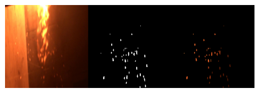

# UNet_firebrand_segmentation

The repository is to create a ML configuration that uses UNet to identify the firebrands from images. 

---

## Data

The data are from the videos of firebrand generation experiments. Initial labelling is conducted manually through labelme [https://github.com/labelmeai/labelme]. 
The sample images can be found in folder ./Datalabelme

## Data Augmentation

Data augmentation is through Augmentor [https://github.com/mdbloice/Augmentor].
Associated pre-processing including moving files and change names can be found in folder ./DataAugumentation

## Model

Unet model can be found online. Reference goes [https://arxiv.org/abs/1505.04597]. The model is in UNetforfirebrand.ipynb

## Training

The model is trained with 30 epochs.

---

## Results

From the last epoch, the trained image is shown here. 

It is hard to say the model can really count the firebrand. Clearly, more images and more training epochs are necessary. 
