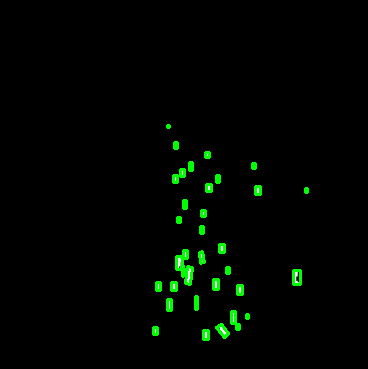
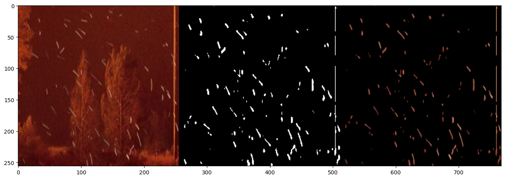

# UNet_firebrand_segmentation

The repository is to create a ML configuration that uses UNet to identify the firebrands from images. 

---

## Data

The data are from the videos of firebrand generation experiments. Initial labelling is conducted manually through labelme [https://github.com/labelmeai/labelme]. 
The sample images can be found in folder ./Data

## Data Augmentation

Data augmentation is through Augmentor [https://github.com/mdbloice/Augmentor].
Associated pre-processing including moving files and change names can be found in folder ./DataAugumentation

## Model

Unet model can be found online. Reference goes [https://arxiv.org/abs/1505.04597]. The model is in UNetforfirebrand.ipynb. Here is the famous network

## Training

The model is trained with 100 epochs.

---

## Results

With 100 epochs. the loss figure shows the convergence. 

The test image is

And the overlap between the predictions and ground-truth(manual labeled) is

The red ones are from ground-truth and white ones are from predictions. Most of the firebrand can be captured if my labelings are correct.

Also, a simple script is added to characterize the firebrand including width, length, angle and number. 

Firebrand under a different condition is also tested to test the generalizability of current model. 

Major firebrand can be captured but a lot small fake predictions are made. 
